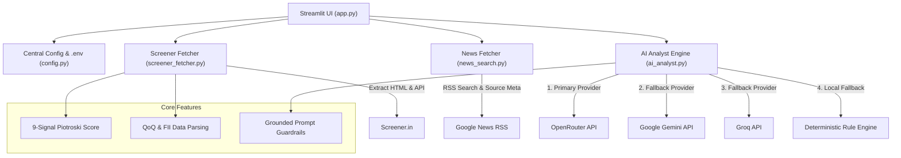

# 📈 Screener.in AI Stock Analyzer & Comparison Engine

An automated financial analysis engine that extracts key ratios, QoQ financial tables, cash flows, and FII/DII shareholding patterns directly from [Screener.in](https://www.screener.in/), combines them with recent web news headlines from Google News RSS, and synthesizes grounded multi-horizon equity research reports using OpenRouter, Google Gemini, or Groq LLMs.

---

## 🏗 Architecture Diagram



---

## ✨ Features

- **Session-State Controlled Execution**: `Analyze Stock` and `Compare Two Stocks` buttons strictly control external network and LLM calls, preventing unintended reruns when typing or switching UI tabs.
- **Robust Ticker Resolution**: Supports absolute URLs (`https://www.screener.in/company/RELIANCE/`), relative paths (`/company/RELIANCE/`), and raw ticker symbols.
- **Real 9-Signal Piotroski F-Score**: Computes mathematically accurate Piotroski score (0–9) using annual P&L, balance sheet, and operating cash flow metrics.
- **Consolidated vs Standalone Basis Tracking**: Identifies and badges whether consolidated or standalone financials were retrieved.
- **Multi-Provider AI Failover**: Automatic fallback chain (OpenRouter → Gemini → Groq → Local Rule-Based Engine) with retries and error classification.
- **Secure Gemini Authentication**: Uses standard `x-goog-api-key` header authorization.
- **Web News Headlines**: Extracts deduplicated news headlines with RSS source metadata and freshness filtering (1, 7, 30 days).
- **Grounded Prompt Guardrails**: Instructs LLM to treat scraped text as untrusted data, ignore prompt injection, avoid hallucinating unsupplied metrics, and cite exact numbers.

---

## ⚙️ Environment Variables & Setup

Create a `.env` file in the root directory (or copy from `.env.template`):

```env
# Primary LLM Provider - OpenRouter
OPENROUTER_API_KEY=your_openrouter_api_key
OPENROUTER_MODEL=google/gemma-2-9b-it:free

# Secondary Provider - Google Gemini
GEMINI_API_KEY=your_gemini_api_key
GEMINI_MODEL=gemini-2.0-flash

# Tertiary Provider - Groq
GROQ_API_KEY=your_groq_api_key
GROQ_MODEL=llama-3.3-70b-versatile

# Configuration Timeouts & Freshness
DEFAULT_TIMEOUT=20
LLM_TIMEOUT=45
DEFAULT_NEWS_FRESHNESS_DAYS=30
```

---

## 🚀 Quick Start

### 1. Installation

```bash
python3 -m venv .venv
source .venv/bin/activate
pip install -r requirements.txt
```

### 2. Run Streamlit App

```bash
streamlit run app.py
```

### 3. Run Command Line Interface (CLI)

```bash
python cli.py RELIANCE
```

---

## 🧪 Testing & CI

Run unit tests 100% offline:

```bash
python -m unittest discover -s tests
```

Validate code compilation:

```bash
python -m compileall .
```

---

## ⚠️ Known Limitations

1. **Screener HTML Dependency**: Scraping relies on Screener.in DOM layout structures. Major website layout updates may require updates to table selectors.
2. **Public News Coverage**: Google News RSS retrieves recent public headlines; proprietary paywalled research reports are not included.
3. **LLM Hallucination Boundaries**: While prompt grounding instructs the LLM to strictly cite numbers from input datasets, LLM outputs should always be cross-verified against official corporate filings.
4. **Educational Purpose Only**: This software is an informational analytical tool and does NOT constitute financial advice or investment recommendations.
