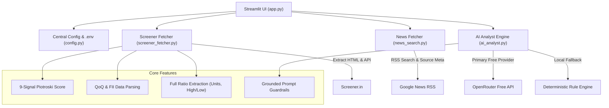

# 📈 Screener.in AI Stock Analyzer & Comparison Engine

An automated financial analysis engine that extracts key ratios, QoQ financial tables, cash flows, and FII/DII shareholding patterns directly from [Screener.in](https://www.screener.in/), combines them with recent web news headlines from Google News RSS, and synthesizes grounded multi-horizon equity research reports using OpenRouter free LLM models.

---

## 🏗 Architecture Diagram



---

## ✨ Features

- **Full Financial Ratios Extraction**: Parses all Screener top ratios with complete formatting, including units (`₹`, `Cr.`, `%`) and dual range metrics (`High / Low`).
- **OpenRouter Free Tier Models**: Powered by OpenRouter free model endpoints (`google/gemma-2-9b-it:free`, `meta-llama/llama-3.3-70b-instruct:free`, `qwen/qwen-2.5-72b-instruct:free`, `deepseek/deepseek-r1:free`).
- **Session-State Controlled Execution**: `Analyze Stock` and `Compare Two Stocks` buttons strictly control external network and LLM calls, preventing unintended reruns when typing or switching UI tabs.
- **Robust Ticker Resolution**: Supports absolute URLs (`https://www.screener.in/company/RELIANCE/`), relative paths (`/company/RELIANCE/`), and raw ticker symbols.
- **Real 9-Signal Piotroski F-Score**: Computes mathematically accurate Piotroski score (0–9) using annual P&L, balance sheet, and operating cash flow metrics.
- **Consolidated vs Standalone Basis Tracking**: Identifies and badges whether consolidated or standalone financials were retrieved.
- **Web News Headlines**: Extracts deduplicated news headlines with RSS source metadata and freshness filtering (1, 7, 30 days).
- **Grounded Prompt Guardrails**: Instructs LLM to treat scraped text as untrusted data, ignore prompt injection, avoid hallucinating unsupplied metrics, and cite exact numbers.

---

## ⚙️ Environment Variables & Setup

Create a `.env` file in the root directory:

```env
# OpenRouter Free LLM Configuration
OPENROUTER_API_KEY=your_openrouter_free_api_key
OPENROUTER_MODEL=google/gemma-2-9b-it:free

# Configuration Timeouts & Freshness
DEFAULT_TIMEOUT=20
LLM_TIMEOUT=45
DEFAULT_NEWS_FRESHNESS_DAYS=30
```

---

## 🚀 Quick Start

### 1. Installation

```bash
python3 -m venv .venv
source .venv/bin/activate
pip install -r requirements.txt
```

### 2. Run Streamlit App

```bash
streamlit run app.py
```

### 3. Run Command Line Interface (CLI)

```bash
python cli.py INFY
```

---

## 🧪 Testing & CI

Run unit tests 100% offline:

```bash
python -m unittest discover -s tests
```

Validate code compilation:

```bash
python -m compileall .
```
