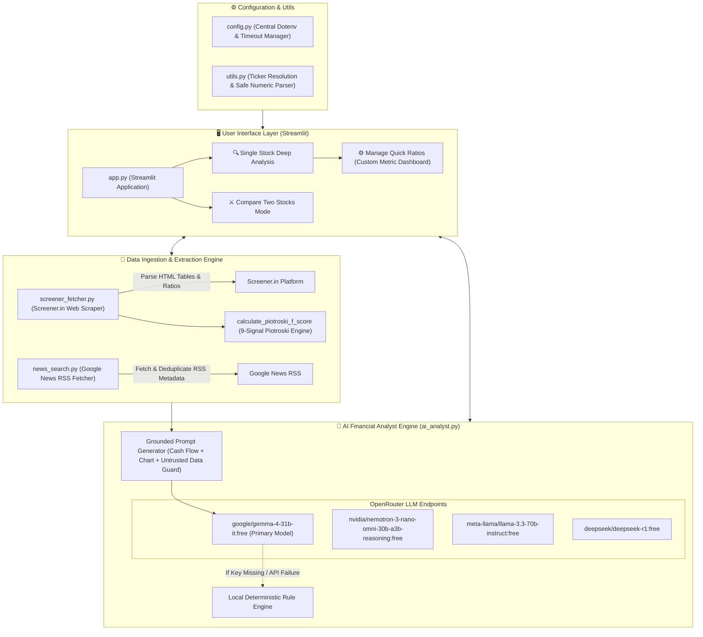

# 📈 Screener.in AI Stock Analyzer & Comparison Engine

An open-source financial intelligence platform that extracts key ratios, QoQ financial tables, annual financial statements, cash flows, and FII/DII shareholding patterns directly from [Screener.in](https://www.screener.in/), pairs them with Google News RSS headlines, and synthesizes grounded multi-horizon equity research reports using OpenRouter free LLM models (featuring **Google Gemma 4 31B**).

---

## 🏛 High-Level System Architecture (HLD)



---

## ⚠️ Important Financial & Legal Disclaimer

> [!IMPORTANT]
> **DISCLAIMER**: This application is strictly an educational and analytical tool designed to extract and organize publicly available financial data. **It does NOT constitute financial advice, investment recommendations, or endorsement to buy or sell securities.**
>
> 1. **No SEBI Registration**: The developer and this software are not registered with SEBI (Securities and Exchange Board of India) or any regulatory financial authority.
> 2. **AI & LLM Hallucinations**: Automated research reports generated by Large Language Models (LLMs) may occasionally omit context, misinterpret complex disclosures, or introduce inaccuracies. Never execute trades based solely on AI-generated summaries.
> 3. **Independent Verification**: Always independently verify financial statements, corporate announcements, and regulatory filings on official stock exchange platforms ([NSE India](https://www.nseindia.com/) / [BSE India](https://www.bseindia.com/)) and consult a certified SEBI-registered financial advisor before taking any investment action.

---

## ✨ Key Features & Capability Matrix

| Capability | Description | Verification Method |
| :--- | :--- | :--- |
| **Interactive Quick Ratios** | Users can select and filter 35+ metrics (Market Cap, P/E, ROCE, ROE, High/Low, OPM %, Debt, Shareholding) to render customized dashboard cards. | Custom multi-select in Streamlit state |
| **Gemma 4 31B AI Integration** | Default integration with Google Gemma 4 31B (`google/gemma-4-31b-it:free`) via OpenRouter, supported by Nemotron Reasoning and Llama 3.3 70B. | Direct API call with retry backoff |
| **9-Signal Piotroski F-Score** | Computes mathematically accurate Piotroski score (0–9) evaluating ROA, CFO, ΔROA, Accruals, ΔLeverage, ΔLiquidity, Share Dilution, ΔMargin, and ΔTurnover. | Automated unit tests (`tests/test_screener.py`) |
| **Full Ratio Formatting** | Extracts complete ratio expressions including dual-value ranges (`High / Low: ₹ 1,728 / 980`) and formatted units (`₹`, `Cr.`, `%`). | `span.value` DOM parsing |
| **Reporting Basis Identification** | Automatically detects and explicitly labels whether retrieved data is on a **Consolidated** or **Standalone** financial basis. | DOM section header verification |
| **Deduplicated News Feed** | Retrieves web headlines via Google News RSS, parses `<source>` metadata tags, enforces freshness windows (1, 7, 30 days), and deduplicates canonical URLs. | `news_search.py` metadata parser |
| **Prompt Injection Protection** | System prompt instructs LLM to treat scraped external text as untrusted DATA, ignore embedded text instructions, and output *"Not available in source data"* for missing metrics. | Prompt grounding guardrails |
| **Deterministic Failover Engine** | Fallback rule engine generates structured financial summaries if no API key is provided or if network services are offline. | `_generate_fallback_analysis()` |

---

## ⚙️ Environment Configuration

Create a `.env` file in the project root:

```env
# Primary LLM Configuration (OpenRouter Free Models)
OPENROUTER_API_KEY=your_openrouter_free_api_key
OPENROUTER_MODEL=google/gemma-4-31b-it:free

# Request Timeouts (seconds)
DEFAULT_TIMEOUT=20
LLM_TIMEOUT=45
DEFAULT_NEWS_FRESHNESS_DAYS=30
```

---

## 🚀 Quick Start Guide

### 1. Environment Setup

```bash
# Clone repository
git clone https://github.com/kvai9826/screener-ai-stock-analyzer.git
cd screener-ai-stock-analyzer

# Create and activate virtual environment
python3 -m venv .venv
source .venv/bin/activate

# Install pinned dependencies
pip install -r requirements.txt
```

### 2. Launch Interactive Web App

```bash
streamlit run app.py
```
Open your web browser at `http://localhost:8501`.

### 3. Run Command Line Interface (CLI)

```bash
python cli.py INFY
```

---

## 🧪 Unit Testing & Quality Assurance

Run the test suite offline (100% mocked external network calls):

```bash
python -m unittest discover -s tests
```

Validate Python syntax compilation across all modules:

```bash
python -m compileall .
```

---

## 📌 Known Technical Limitations

1. **DOM Layout Sensitivity**: Screener.in DOM layout changes may require updates to table CSS selectors.
2. **RSS News Reach**: Google News RSS fetches public headlines; paywalled financial subscription publications are excluded.
3. **Historical Data Range**: Ratios and tables represent the most recent available filings parsed from Screener.in.
